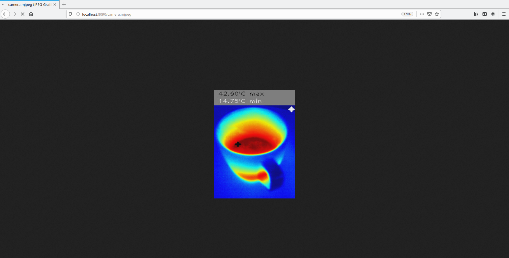

# texd - A http streaming service for thermal imaging cameras by Thermal Expert

# Project scope
This project provides a service to stream thermal imaging data in MJPEG format via http.  
It supports the models TE-M1&TE-Q1 and can be adapted to support further Thermal Expert/i3 System cameras.  
Image overlays to show temperature and hotspots are implemented and camera calibration is supported.  

  
sample image M1 with overlays  

# Installation
Plug & Play support is provided for Ubuntu/Debian x86_x64 and ARM architecture (Raspberry Pi).  

## Thermal Expert / i3 System driver installation
The i3 System driver library must be installed first:  
Note: "x86-64" must be replaced by "armhf" on Raspberry Pi.
<pre><code>
sudo chmod +x i3system_sdk_x86-64.run  
sudo ./i3system_sdk_x86-64.run  
sudo ldconfig  
</code></pre>
The script may request to download further packages.

## Dependency installation
The following packages need to be installed:  
Note: The installation may need to download several hundred MB and will take some time!
<pre><code>
sudo apt update  
sudo apt install libconfig++9v5 libudev1 libopencv-dev  
</code></pre>
## texd installation
The texd service can be installed by running:  
Note: "amd64" must be replaced by "armhf" on Raspberry Pi.
<pre><code>
sudo dpkg -i texd_1.1.0-1_amd64.deb texd-ffserver_1.1.1-1_amd64.deb
</code></pre>
Afterwards the texd status can be checked using:
<pre><code>
sudo systemctl status texd  
sudo systemctl status texd-ffserver  
</code></pre>
If the service is not running it can be started using:
<pre><code>
sudo systemctl start texd texd-ffserver  
</code></pre>
texd will start automatically each boot but this behaviour can be controlled using:
<pre><code>
sudo systemctl enable/disable texd texd-ffserver
</code></pre>

# Accessing the stream
The http stream can be accessed by any web browser.  

By default the link is:  
http://DEVICE-IP:8090/camera.mjpeg  
**"DEVICE-IP" must be replaced by the ip-address of the device!**  

On the Raspberry Pi the following link may work:  
http://raspberrypi.local:8090/camera.mjpeg  

On the Thermal Expert Raspberry Pi image this link works:  
http://thermalexpert.local:8090/camera.mjpeg  

The MJPEG stream can be easily embedded in websites or used by applications such as the VLC.  
**Please note that the stream is not password protected and can be accessed by anyone in the network!**  
If a password protection is necessary a http(s) proxy with authentication such as the Apache or NGINX webserver can be used.  
Note: The "#ACL allow 127.0.0.1" in the server.conf file can be enabled to allow only access from localhost.   

## Stream embedded in HTML
This simple example shows how to embed the stream in HTML using the img tag.  

    <!DOCTYPE html>
    <html>
    <body>
        <h1>Stream embedded in a website</h1>
        
    </body>
    </html>

# Configuration and calibration

## texd (/etc/texd/texd.conf)
The texd service support several configuration parameters.
<pre><code>
calibration_directory_path="/etc/texd" # Directory where calibration files are stored   
image_overlay="on"                     # Controls the information overlay applied to the image (on | off | temperature | marker)  
internal_tcp_port="7444"               # TCP port for internal communication (change only if conflicting)  
ffmpeg_server_tcp_port="8090"          # Port for communication with texd-ffserver (must be changed on both)  
emissivity="10"                        # Emissivity setting applied to the measured temperature (10 is default)  
rotation="270"                         # 0, 90, 180, 270  
temp_offset="0"                        # max. 20° to -20° C
</code></pre>
**texd must be restarted using "systemctl restart texd" after changing parameters!**

## texd-ffserver (/etc/texd_ffserver/server.conf)
The texd-ffserver is a service controlling the ffmpeg ffserver.

The configuration file parameters can be found here:  
https://trac.ffmpeg.org/wiki/ffserver

**texd must be restarted using "systemctl restart texd-ffserver" after changing parameters!**

## Calibration
texd supports persistent calibration which improves image quality.  
Please check your camera user manual how to prepare the physical setup before calibration!  

If the camera is ready for calibration the following command must be executed:  
<pre><code>
sudo pkill texd -SIGUSR1  
</code></pre>
It sends the USR1 signal to the texd service which starts the calibration.  
The result can be checked using:  
<pre><code>
sudo systemctl status texd  
"texd[322]: Successfully saved calibration data to /etc/texd/q1.dat"  
</code></pre>
Different calibration files are automatically used for M1/Q1 models.  
On restart texd will automatically load the saved calibration file.  

## Latency optimization
Streaming latency on low power devices (Raspberry Pi 1/A+/Zero) can be optimized by this factors:  
video resolution: The VideoSize parameter in the ffserver config file must be reduced.  
image overlays: The image_overlay parameter in the texd config file must be turned off.  

An ARMv7+ dual core or better (Raspberry Pi 2/ 3/ 4) is recommended for lossless streaming.  

# Architecture

## texd
The texd service uses the i3 System driver library to access the raw image data.  
It uses opencv to convert them into JPEG format and pipes them to the ffmpeg subprocess.  
The ffmpeg subprocess converts the data into a MJPEG stream and pipes it via tcp socket to the texd-ffserver.  

## texd-ffserver
The texd-ffserver controls the ffmpeg ffserver program.  
It provides the MJPEG data via http to the network.  

## Device detection
The texd service tries to find and initialize the camera on startup.  
If it fails the service stops and returns an error code, systemd will automatically restart the service after a few seconds.  
This auto restart procedure is applied to handle all errors and to ensure the auto recovery/detection of the service.  

## ffmpeg support
To avoid ffmpeg version issues the package includes a static linked version of ffmpeg 3.4.7.  
Source: https://www.ffmpeg.org/releases/ffmpeg-3.4.7.tar.xz  
Guide: https://trac.ffmpeg.org/wiki/CompilationGuide  

# Development

## Installation requirements
**In addition** to the basic installation the following packages need to be installed:  
<pre><code>
sudo apt install gcc make libopencv-dev libudev-dev libconfig++-dev  
</code></pre>
## Compilation
To compile texd you need to run:

On a x86_x64 platform:  
<pre><code>
make texd-x64  
</code></pre>
On a ARM (Raspberry Pi) platform:  
<pre><code>
make texd-armhf  
</code></pre>
On a ARM (Raspberry Pi) platform with opencv2:  
<pre><code>
make texd-armhf-opencv2  
</code></pre>
The compilation will fail if the platform is wrong or dependencies are not met!

# License information
The installer package contains a compiled (binary) version of ffmpeg.  
ffmpeg is licenced under the conditions of "GNU LESSER GENERAL PUBLIC LICENSE VERSION 2.1".  
https://ffmpeg.org/legal.html  
https://github.com/FFmpeg/FFmpeg/blob/master/COPYING.LGPLv2.1  

